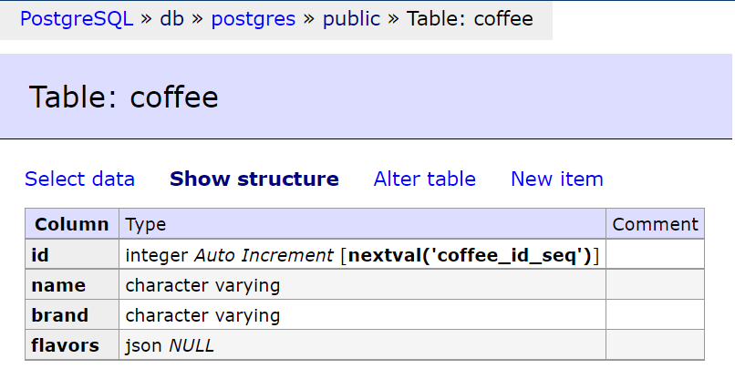

# NestJS Fundamentals

A guide from the [Official NestJS Fundamentals](https://courses.nestjs.com/).

## 1. Installation

- `$ npm i -g @nestjs/cli`
- `$ nest --version` (current version **7.5.1**)
- `$ nest new`: Provide a name for your app and the package manager of your choice, e.g. `coffee app` and `yarn`
- `$ cd coffee-app`
- `$ yarn start`

_NOTE_: Decorators (@Module, @Controller,...) are functions that apply logic. They can be applied to classes, methods, properties and parameters.

## 2. Creating a REST API application

- Run NestJS in development mode: `yarn start:dev`.

  ### 2.1. Creating a Basic Controller ([Full Controllers documentation](https://docs.nestjs.com/controllers)):

  - Controllers are one of the most important building blocks in NestJS application as they handle requests.
  - Create a controller with the CLI:
    - `$ nest generate controller` or `$ nest g co`: provide the name of it, e.g. 'coffees'.
    - Some flags:
      - `$ nest g co --no-spec`: without the test file;
      - `$ nest g co modules/abc --dry-run`: to try a command, e.g. where it would be allocated.
  - In order to create a basic controller, we use classes and decorators. Decorators associate classes with required metadata and enable Nest to create a routing map (tie requests to the corresponding controllers).
  - Nest provides decorators for all of the standard HTTP methods: `@Get()`, `@Post()`, `@Put()`, `@Delete()`, `@Patch()`, `@Options()`, and `@Head()`. In addition, `@All()` defines an endpoint that handles all of them.
  - The route path for a handler is determined by concatenating the (optional) _prefix_ declared for the controller, and any _path_ specified in the method's decorator. Using a path prefix in a @Controller() decorator allows us to easily group a set of related routes, and minimize repetitive code. For example, a path prefix of 'coffees' combined with the decorator @Get(`flavours`) would produce a route mapping for requests like GET `/coffees/flavours`.

    #### 2.1.1. Using Route Parameters:

    - In order to define routes with parameters, we can add route parameter tokens in the path of the route to capture the dynamic value at that position in the request URL. Route parameters declared in this way can be accessed using the @Param() decorator, which should be added to the method signature.
    - @Param() is used to decorate a method parameter (e.g. `params`), and makes the route parameters available as properties of that decorated method parameter inside the body of the method. So, we can access the id parameter by referencing `params.id`. You can also pass in a particular parameter token to the decorator, and then reference the route parameter directly by name in the method body: `@Param('id') id: string`.

    #### 2.1.2. Response Status Codes:

    - The response **status code** is always **200** by default, except for POST requests which are **201**. We can easily change this behavior by adding the `@HttpCode(...)` decorator at a handler level.

    #### 2.1.3. Query Params:

    - Nest has a helpful decorator for getting all or a specific portion of the query parameters called `@Query()`, which works similar to `@Param()` and `@Body()`.

  ### 2.2. Creating a Basic Service ([Full Providers documentation](https://docs.nestjs.com/providers)):

  - Many of the basic Nest classes may be treated as a **provider** – _services, repositories, factories, helpers_, and so on. The main idea of a provider is that it can be injected as dependency; this means objects can create various relationships with each other.
  - Controllers should handle HTTP requests and delegate more complex tasks to providers. Providers are plain JavaScript classes that are declared as providers in a module.
  - To create a service using the CLI, simply execute the command `$ nest g service coffees` or `$ nest g s`.
  - The `@Injectable()` decorator attaches metadata, which declares that CatsService is a class that can be managed by the Nest IoC container.
  - The CoffeesService is injected through the **class constructor**. Notice the use of the private syntax. This shorthand allows us to both declare and initialize the coffeesService member immediately in the same location.
  - Nest is built around the strong design pattern commonly known as **Dependency injection**. In Nest, thanks to TypeScript capabilities, it's extremely easy to manage dependencies because they are resolved just by type. Nest will resolve the _coffeesService_ by creating and returning an instance of _CoffeesService_ (or, in the normal case of a singleton, returning the existing instance if it has already been requested elsewhere). This dependency is resolved and passed to your controller's constructor (or assigned to the indicated property).

    #### 2.2.1. Handling errors:

    - Nest provides a built-in **HttpException** class and a set of standard exceptions that inherit from the base HttpException, like **NotFoundException**:
      ```ts
      throw new HttpException(`Coffee #${id} not found`, HttpStatus.NOT_FOUND);
      throw new NotFoundException(`Coffee #${id} not found`);
      ```
    - [Further information about Exception filters](https://docs.nestjs.com/exception-filters)

  ### 2.3. Creating a Basic Module ([Full Modules documentation](https://docs.nestjs.com/modules)):

  - A module is a class annotated with a `@Module()` decorator. The @Module() decorator provides metadata that Nest makes use of to organize the application structure. It takes a single object whose properties describe the module:
    - The **providers** that will be instantiated by the Nest injector and that may be shared at least across this module;
    - The set of **controllers** defined in this module which have to be instantiated;
    - The list of imported modules or **imports** that export the providers which are required in this module;
    - Thw subset of providers or **exports** that are provided by this module and should be available in other modules which import this module.
  - Each application has at least one module, a **root module**. The root module is the starting point Nest uses to build the application graph (the internal data structure Nest uses to resolve module and provider relationships and dependencies).
  - Modules are strongly recommended as an effective way to organize your components. Thus, for most applications, the resulting architecture will employ multiple modules, each encapsulating a closely related set of capabilities.
  - To create a module using the CLI, simply execute the command `$ nest g module coffees`.

  ### 2.4. Data Transfer Objects

  - A DTO (Data Transfer Object) is an object that defines how the data will be sent over the network. We could determine the DTO schema by using TypeScript interfaces, or by simple classes. Interestingly, it is recommended using classes since they are part of the JavaScript ES6 standard, and therefore they are preserved as real entities in the compiled JavaScript. On the other hand, since TypeScript interfaces are removed during the transpilation, Nest can't refer to them at runtime. This is important because features such as Pipes enable additional possibilities when they have access to the metatype of the variable at runtime.
  - To create a DTO using the CLI, simply execute the command `$ nest g class coffees/dto/create-coffee.dto --no-spec`. Creating this file within a dedicated `/dto` directory in 'coffees' folder is a great application convention to
    get into not only for other DTO's but also for similarly group, such as interfaces and entities. All grouped within their associated module.
  - One other great best practice with DTO's is marking all of the properties as `readonly` to help maintain immutability.
  - `$ yarn add class-validator class-transformer`

    #### 2.4.1. Validating Input Data with DTOs:

    - It's a common best practice for any back end to validate the correctness of data being sent into our applications, and it's even more ideal if we can automatically validate these incoming requests. NestJS provides the **ValidationPipe** to solve this exact problem. The ValidationPipe provides a convenient way of enforcing validation rules for all incoming client payloads.
    - Implementation:
      - `@ main.ts`:
        ```ts
        app.useGlobalPipes(new ValidationPipe());
        ```
      - `$ yarn add class-validator class-transformer`
    - NestJS provides several utility functions as part of the package `@nestjs/mapped-types`: `$ yarn add @nestjs/mapped-types`. _PartialType_ function is really helpful because not only marks, all the fields is optional (no more duplicate code!), but it also inherits all the validation rules applied via decorators, as well as adds a single additional validation rule to each field the `@IsOptional()` rule on the fly.
    - The ValidationPipe has many great features. For example:
      - _whitelist_: it filters out properties that should NOT be received by a method handler;
      - _forbidNonWhitelisted_: this property, in combination with whitelist, will STOP a request from being processed if any non-white listed properties are present. Throwing an error instead.
      - _transform_: since the request payloads typically come over the network as plain JS objects, this feature ensures that the payloads come in the shape we expect. It not only saves us time, but also helps us be more aware of what types we're dealing with, whether they are primitive, like Boolean, Number or even our custom DTOs. However, be aware that this feature may very slightly impact performance.
      ```ts
        new ValidationPipe({
          whitelist: true,
          forbidNonWhitelisted: true,
        }),
      ```

## 3. PostgreSQL with TypeORM

- **Docker** is a platform for developers to build, run and share applications that are within containers. The use of containers to deploy application is called **containerization** and has become increasingly popular over the years due to many benefits they bring to the development process, such as flexible, lightweight, portable and loosely coupled. This last one means that containers are highly self sufficient and encapsulated, allowing them to be replaced or upgraded without disrupting any other containers.
- **PostgreSQL** is not only one of the most performant, feature filled database management systems out there, but it is also free! In the past, we may have gone to the Postgres website, installed the database locally on our machines. However, let's take advantage of Docker to handle all of this for us. A Docker image is a multilayered file that will execute code within a Docker container, and in this case it will be creating a PostgreSQL database. Fo the YAML file, the `port` to `5432:5432` indicates the default port for PostgreSQL both internally, within the container, but also accessible outside of Docker, on the same port.

  - `docker-compose.yml`
  - `$ docker compose up -d`. The -d flag means that we want to run our containers in "detached" mode. Meaning that they are going to be running in the background.

  ### 3.1. TypeORM

  - Nest itself is database agnostic, allowing you to easily integrate with any SQL or NoSQL database of your choice. There are a lot of different ways you can integrate Nest with DBs, and they all depend on your personal preferences or project's needs.
  - **TypeORM** is a popular, mature and fully featured Object Relational Mapper (ORM). It lets interact with entities in DBs in a Type safe and incredibly simple manner, allowing to get things done faster than ever. This time we will set up TypeORM with the Postgres database that we have up and running in our Docker container. However, TypeORM provides support for many other relational databases such as MySQL, Microsoft, SQLite and even NoSQL databases like MongoDB.
    - `$ yarn add @nestjs/typeorm pg`
    - Add the configuration needed in the `app.module.ts`: 
      - Port and password must match with the `docker-compose.yml` file; 
      - `autoLoadEntities` helps load modules automatically instead of specifying the entities Array; 
      - `synchronize` ensures that our TypeORM entities will be synched with the DB every time we run our application.
      **IMPORTANT**: Make sure you DISABLE THIS when you are in Production!
      **NOTE**: Nest v8 uses RxJS v7, which no longer has a `toPromise()` method for Observables,but the `lastValueFrom` method instead. If you're receiving this error, you probably need to update your rxjs dependency to >7.
  - Applications often run in different environments. Depending on the environment, different configuration settings should be used. For example, usually the local environment relies on specific database credentials, valid only for the local DB instance. The production environment would use a separate set of DB credentials. Since configuration variables change, best practice is to store configuration variables in the environment. A good approach for using this technique in Nest is to create a _ConfigModule_ that exposes a ConfigService which loads the appropriate **.env** file. While you may choose to write such a module yourself, for convenience Nest provides the `@nestjs/config` package out-of-the box.
      - `$ npm i --save @nestjs/config`
      - Configure `app.module.ts`. [Further information](https://docs.nestjs.com/techniques/configuration)

  - **Entity** represents a relationship between a TypeScript class and a Database table, and in the case of Nest apps, the entities will be classes decorated with the `@Entity()` decorator. For example, passing the String 'coffees' into the decorator will generate a 'Coffees' table instead.
    - `@PrimaryGeneratedColumn()` decorator will not only define ID as the primary column, but also auto increment the value for us;
    - `@Column()` decorator admits two arguments, first for the type of column and the second one for options.
  
    